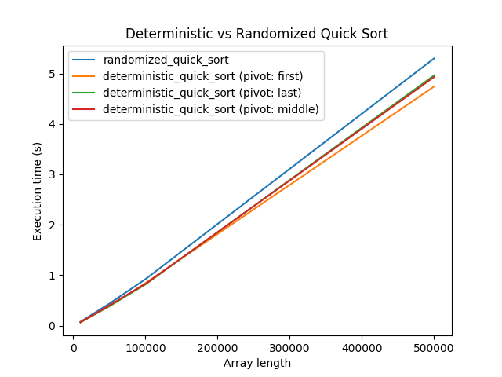
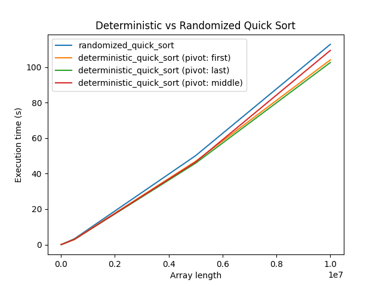
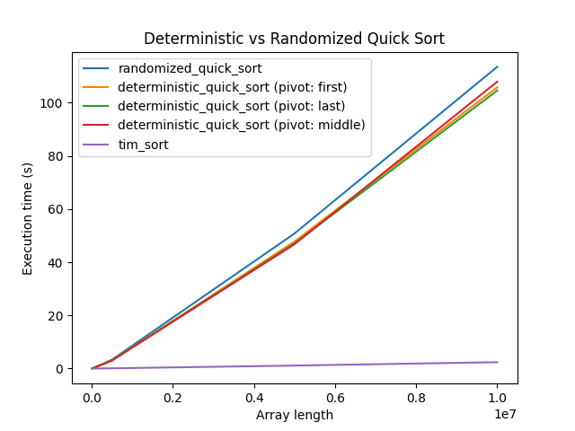

# goit-algo2-hw-10

## Завдання 1

Результати за вказаними в ТЗ розмірами масивів:

```log
Розмір масиву: 10000
Час виконання randomized_quick_sort: 0.0768  секунд
Час виконання deterministic_quick_sort (перший елемент): 0.0657  секунд
Час виконання deterministic_quick_sort (останній елемент): 0.0674  секунд
Час виконання deterministic_quick_sort (середній елемент): 0.0665  секунд
--------------------------------------------------------------------------------
Розмір масиву: 50000
Час виконання randomized_quick_sort: 0.4359  секунд
Час виконання deterministic_quick_sort (перший елемент): 0.3825  секунд
Час виконання deterministic_quick_sort (останній елемент): 0.3867  секунд
Час виконання deterministic_quick_sort (середній елемент): 0.4034  секунд
--------------------------------------------------------------------------------
Розмір масиву: 100000
Час виконання randomized_quick_sort: 0.9209  секунд
Час виконання deterministic_quick_sort (перший елемент): 0.8425  секунд
Час виконання deterministic_quick_sort (останній елемент): 0.8167  секунд
Час виконання deterministic_quick_sort (середній елемент): 0.8272  секунд
--------------------------------------------------------------------------------
Розмір масиву: 500000
Час виконання randomized_quick_sort: 5.2981  секунд
Час виконання deterministic_quick_sort (перший елемент): 4.7415  секунд
Час виконання deterministic_quick_sort (останній елемент): 4.9618  секунд
Час виконання deterministic_quick_sort (середній елемент): 4.9303  секунд
--------------------------------------------------------------------------------
```



При збільшенні розміру тестових масивів тенденція залишається такою ж, як і в початкових тестах.


Порівняння часу виконання алгоритмів Quick Sort з алгоритмом сортування у Python за замовчуванням (Timsort).



Як висновок, можна сказати, що алгоритм Quick Sort у конкретному виконанні працює швидше з детермінованим pivot. Це може бути пов'язано з накладними ресурсами, які витрачаються на генерацію випадкового числа у randomized_quick_sort, а також з особливістю вхідних даних.

## Завдання 2

За допомогою жадібного алгоритму отримали розклад:

```log
# python 02.py 
Розклад занять:
Марія Петренко, 35 років, email: m.petrenko@example.com
   Викладає предмети: Хімія

Олександр Іваненко, 45 років, email: o.ivanenko@example.com
   Викладає предмети: Фізика

Сергій Коваленко, 50 років, email: s.kovalenko@example.com
   Викладає предмети: Математика

Наталія Шевченко, 29 років, email: n.shevchenko@example.com
   Викладає предмети: Біологія

Дмитро Бондаренко, 35 років, email: d.bondarenko@example.com
   Викладає предмети: Інформатика

```
